# StereoKitSample

[StereoKit](https://github.com/maluoi/StereoKit) を利用した、そのまま部品として利用できそうなアプリのサンプル集です。

## 動作確認方法
ソリューション内には、.NET Core プロジェクトと UWP プロジェクトが含まれていますが UWP プロジェクト内のほとんどのファイルは .NET Core プロジェクトへのリンクとなっています。

PC で動作確認する場合は .NET プロジェクトでも UWP プロジェクトでも可能です。
HoloLens 2 実機で動作確認する場合は StereoKitSample_UWP プロジェクトでアーキテクチャを ARM64 にしてビルド・デプロイしてください。

Program.cs の以下行を Samples フォルダ配下にある確認したいクラス名に変更してビルドすることで様々な機能について動作確認できます。

``` cs
var app = new FirstApp(); // ★ここを確認したいサンプルのクラスに変更する
```

## PCでの操作方法

| 操作 | シミュレーション内容 |
----|---- 
| マウスの移動 | 手の上下左右移動 |
| マウスホイール | 手の奥行き移動 |
| マウスの左クリック | つかむ |
| マウスの右クリック | つつく |
| マウスの左クリック + 右クリック | 手を閉じる |
| Shift(またはCaps Lock) + マウスの右クリック + マウスの移動 | 頭の回転 |
| Shift(またはCaps Lock) + W A S D Q Eキー | 頭の移動 |
| Alt + マウス操作 | アイトラッキングのシミュレート |

## サンプル

以下はサンプルの一覧です。StereoKit リポジトリ配下にも[デモコンテンツ](https://github.com/maluoi/StereoKit/tree/master/Examples)が用意されておりそれらと同等のものも含まれていますが、日本語のコメントを付けたり、より部品として使いやすいように最低限の内容に絞ったりしています。

- [ChangeMaterialApp](./StereoKitSample/StereoKitSample/Samples/ChangeMaterialApp.cs)
  - マテリアルを変更するサンプル

    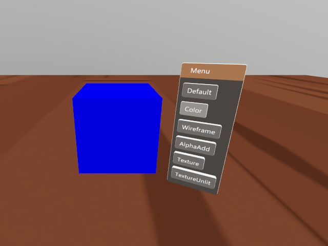

- [CubeAnimApp](./StereoKitSample/StereoKitSample/Samples/CubeAnimApp.cs)
  - Cubeのアニメーションサンプル

    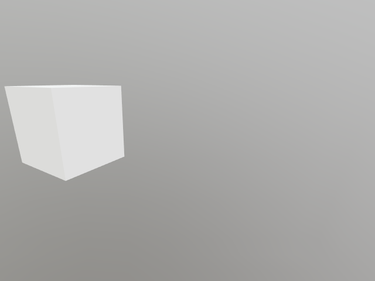

- [DefaultMeshApp](./StereoKitSample/StereoKitSample/Samples/DefaultMeshApp.cs)
  - StereoKit に用意されているメッシュを表示するサンプル

    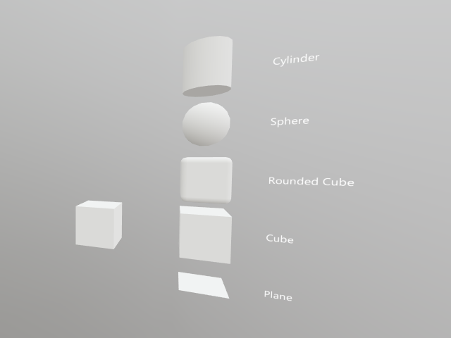

- [EyeTrackingApp](./StereoKitSample/StereoKitSample/Samples/EyeTrackingApp.cs)
  - アイトラッキングのサンプル

    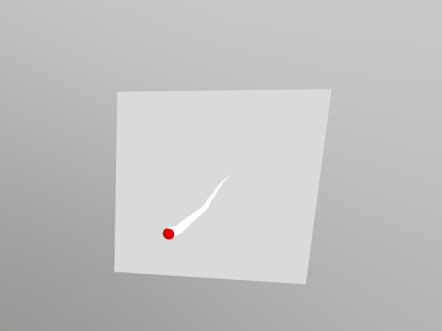

- [FilePickerApp](./StereoKitSample/StereoKitSample/Samples/FilePickerApp.cs)
  - ファイルの保存・読み込みを行うサンプル

    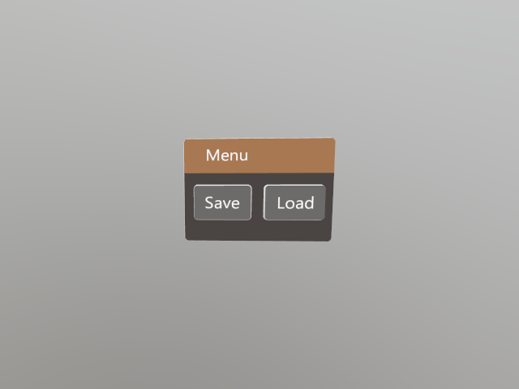

- [FirstApp](./StereoKitSample/StereoKitSample/Samples/FirstApp.cs)
  - プロジェクト作成時に生成されるひな形を別クラスに分けて動作するようにしたもの

    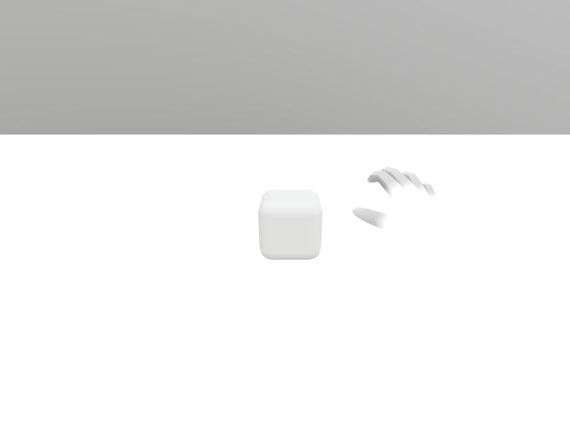

- [HandMenuApp](./StereoKitSample/StereoKitSample/Samples/HandMenuApp.cs)
  - ハンドメニューのサンプル

    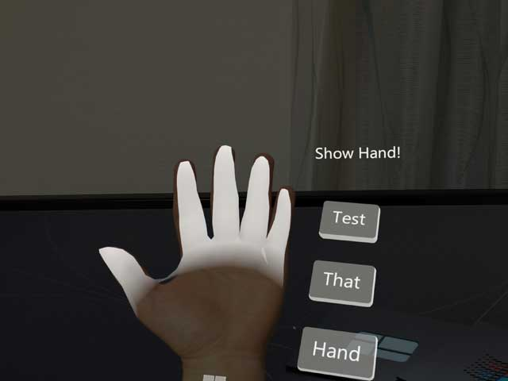

- [HandMenuRadialApp](./StereoKitSample/StereoKitSample/Samples/HandMenuRadialApp.cs)
  - ラジアルハンドメニューのサンプル

    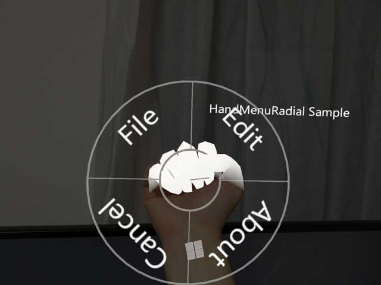

- [InstantiateModelApp](./StereoKitSample/StereoKitSample/Samples/InstantiateModelApp.cs)
  - 動的にモデルを生成するサンプル

    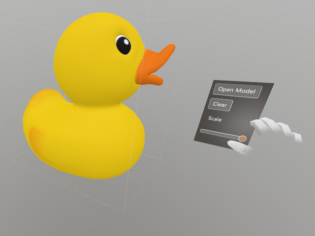

- [MenuApp](./StereoKitSample/StereoKitSample/Samples/MenuApp.cs)
  - メニューの表示と StereoKit で利用可能な UI のサンプル

    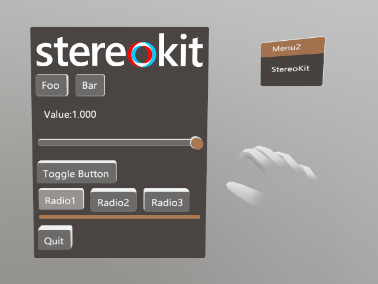

- [MicrophoneApp](./StereoKitSample/StereoKitSample/Samples/MicrophoneApp.cs)
  - マイクを利用するサンプル

    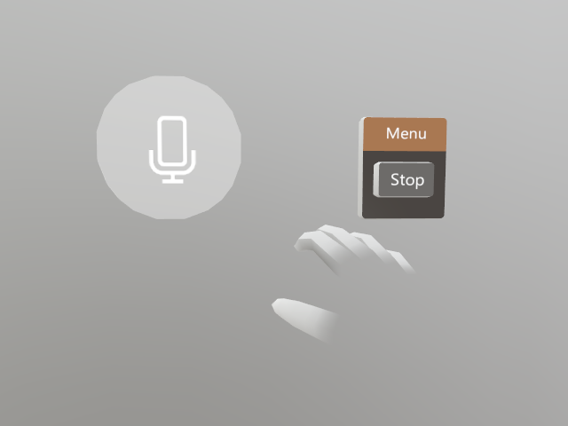

- [ModelApp](./StereoKitSample/StereoKitSample/Samples/ModelApp.cs)
  - 3Dモデルを表示するサンプル

    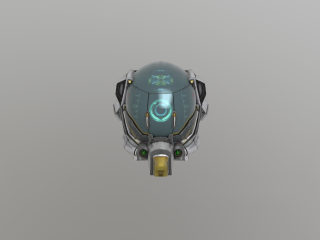

- [PointerApp](./StereoKitSample/StereoKitSample/Samples/PointerApp.cs)
  - ポインターのサンプル

    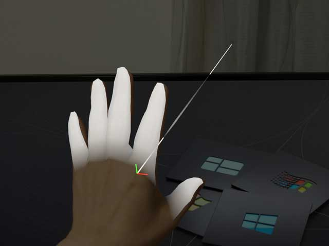

- [PoseApp](./StereoKitSample/StereoKitSample/Samples/PoseApp.cs)
  - ヘッド、ハンド、人差し指、オブジェクトの位置・前方ベクトル、マウスの位置を表示するサンプル

    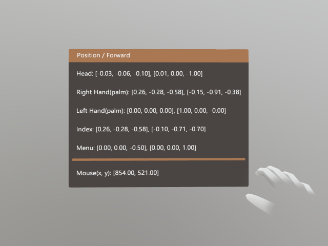

- [QRCodeApp](./StereoKitSample/StereoKitSample/Samples/QRCodeApp.cs)
  - QRコードトラッキングのサンプル

    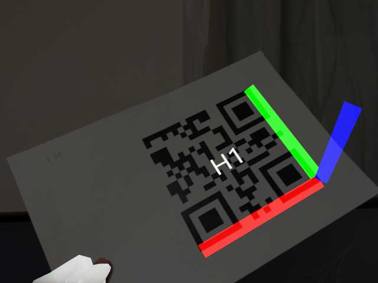

- [RayCastApp](./StereoKitSample/StereoKitSample/Samples/RayCastApp.cs)
  - レイキャストのサンプル

    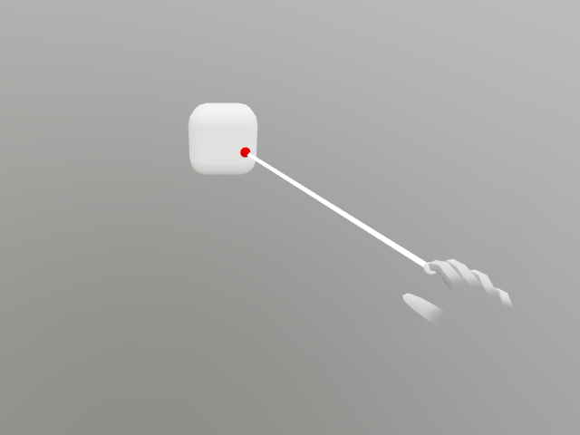

- [SoundApp](./StereoKitSample/StereoKitSample/Samples/SoundApp.cs)
  - サウンドを再生するサンプル

    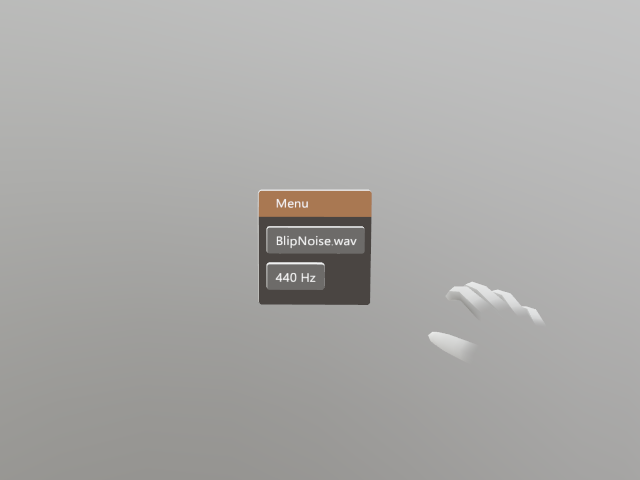

- [SpatialMappingApp](./StereoKitSample/StereoKitSample/Samples/SpatialMappingApp.cs)
  - 空間メッシュを表示するサンプル

    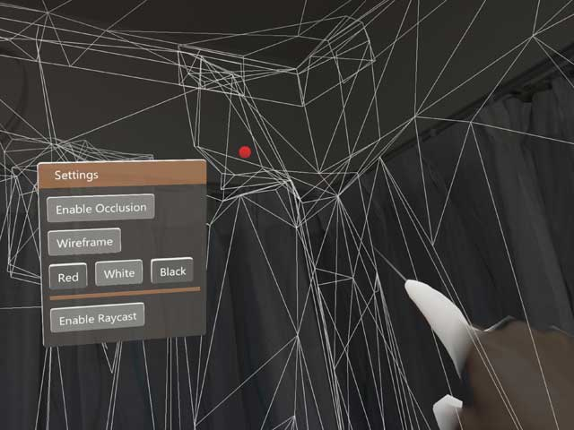
